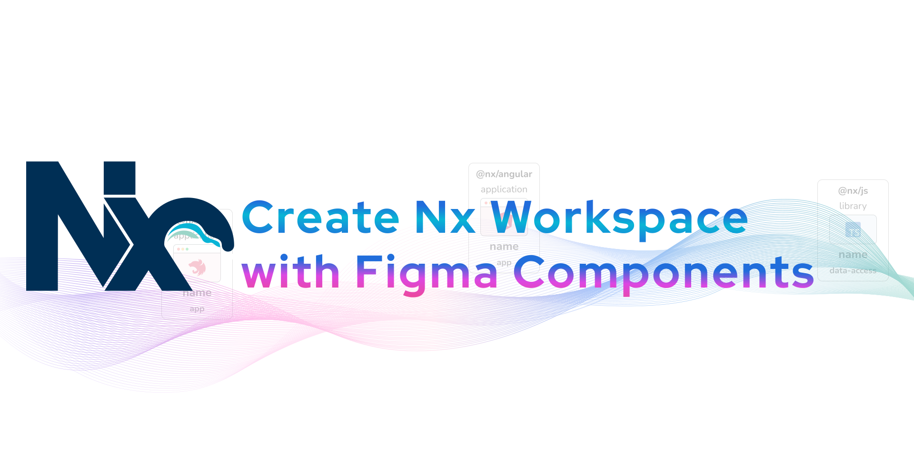

# Create Nx Workspace
with Figma Components

- [Components](https://www.figma.com/community/file/1273612854141026317/Nx-Plugins---Create-Nx-Workspace)
- [Plugin Figma](https://www.figma.com/community/plugin/1273614250700669298/create-nx-workspace)

